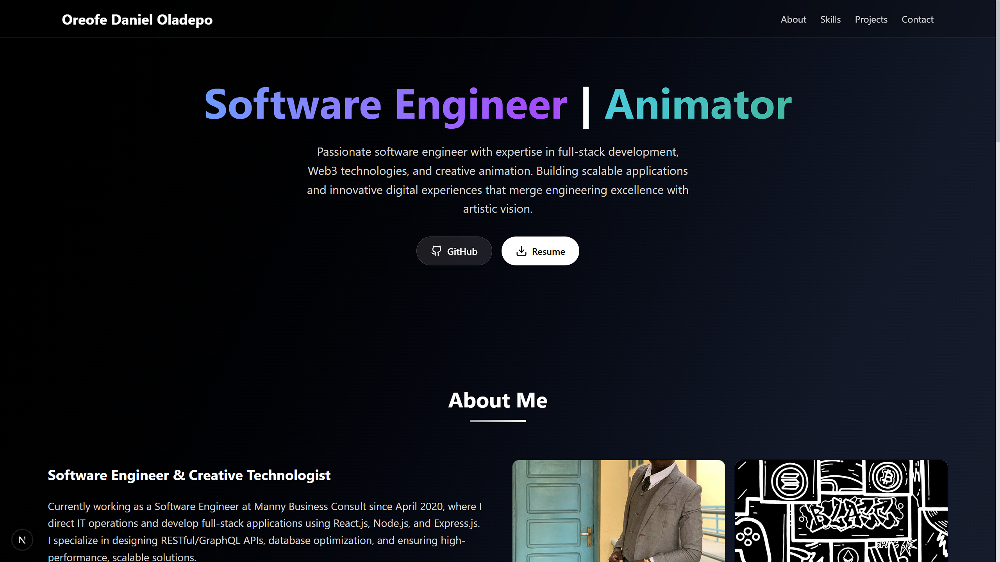
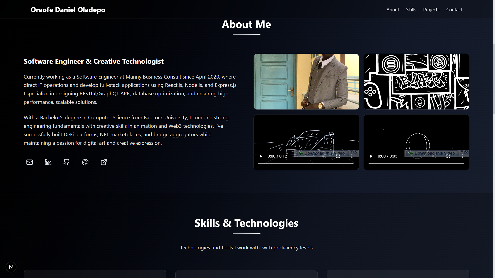
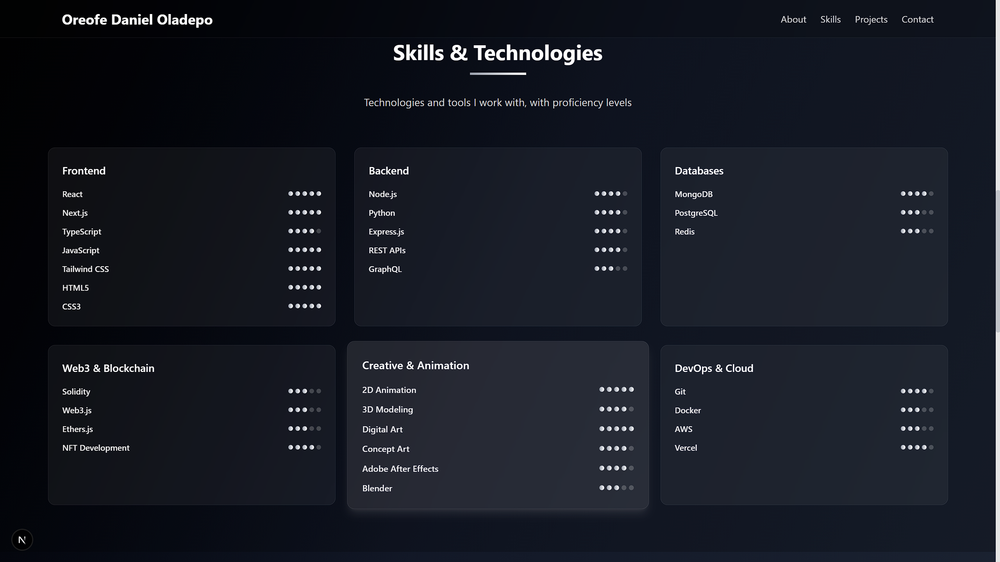
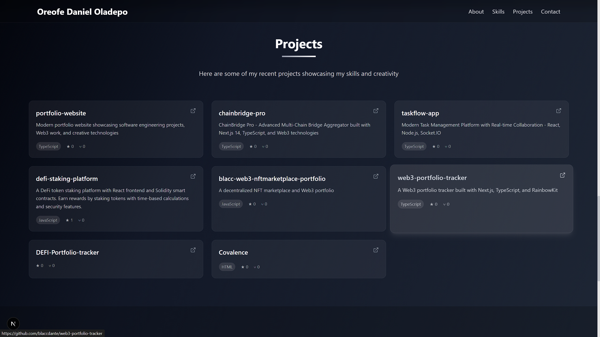
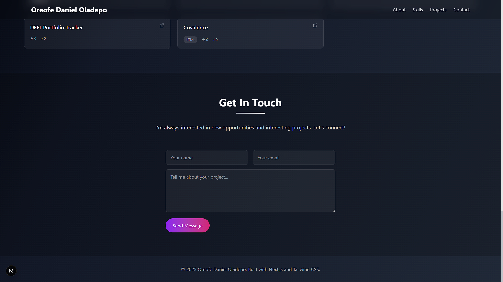

# Portfolio Website

A modern, responsive portfolio website built with React, TypeScript, and Vite.

## 🚀 Features

- Modern React with TypeScript
- Fast development with Vite
- Responsive design
- Clean and professional UI

## 📸 Screenshots

### Desktop Views











## 🛠️ Built With

- **Frontend**: React + TypeScript + Vite
- **Backend**: Node.js + Express
- **Styling**: Modern CSS/Tailwind CSS

## 🏃‍♂️ Getting Started

### Prerequisites

- Node.js (v16 or higher)
- npm or yarn

### Installation

1. Clone the repository
```bash
git clone <your-repo-url>
cd portfolio-app
```

2. Install frontend dependencies
```bash
cd frontend
npm install
```

3. Install backend dependencies
```bash
cd ../backend
npm install
```

### Development

1. Start the backend server
```bash
cd backend
npm run dev
```

2. Start the frontend development server
```bash
cd frontend
npm run dev
```

3. Open [http://localhost:5173](http://localhost:5173) to view it in the browser

## 📂 Project Structure

```
portfolio-app/
├── frontend/          # React frontend
│   ├── public/
│   │   └── screenshots/  # Portfolio screenshots
│   ├── src/
│   └── package.json
├── backend/           # Express backend
│   ├── src/
│   └── package.json
└── README.md
```

## 🚀 Deployment

The application can be deployed to various platforms:

- **Frontend**: Vercel, Netlify, or any static hosting service
- **Backend**: Heroku, Railway, or any Node.js hosting service

## 📝 License

This project is open source and available under the [MIT License](LICENSE).

## 📧 Contact

Feel free to reach out if you have any questions or suggestions!